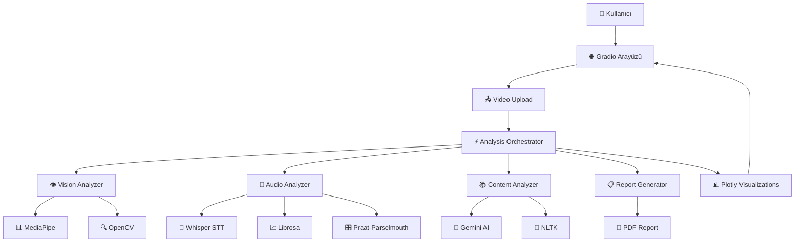

# 🎓 EduView - AI ile Kayıttan Eğitim Analizi

**EduView**, öğretmenler ve öğrencilerin ders anlatım videolarını yapay zeka ile analiz ederek sunum becerilerini geliştirmelerine yardımcı olan kapsamlı bir eğitim analiz platformudur.

## 🚀 Özellikler

### 🎯 Ana Analiz Modülleri

1. **👁️ Beden Dili ve Göz Teması Analizi (Computer Vision)**
   - Göz teması kurulmayan süreleri tespit eder
   - Duruş, jest ve mimiklerin etkinliğini değerlendirir
   - Kıpırdanma, sırt dönme gibi negatif davranışları raporlar
   - MediaPipe ve OpenCV tabanlı görüntü işleme

2. **🎤 Ses Tonu ve Akıcılık Analizi (Speech Analysis)**
   - Ses tonunun monotonluğu, vurgu eksiklikleri
   - "Eee, şey" gibi dolgu kelimeler tespit edilir
   - Konuşma hızı ve duraklamalar analiz edilir
   - Whisper ve Librosa ile ses işleme

3. **📚 İçerik Kontrolü ve Eksik Konu Tespiti (NLP)**
   - Konunun bütünlüğü Gemini AI ile kontrol edilir
   - Eksik anlatılmış konular belirlenir ve önerilerle sunulur
   - Anahtar kelime yoğunluk analizi
   - Eğitimsel yapı değerlendirmesi

4. **📊 Kapsamlı Performans Skoru**
   - **Beden dili**: 25 puan
   - **Ses kalitesi**: 25 puan
   - **İçerik akışı**: 25 puan
   - **Etkileşim ve örneklendirme**: 25 puan
   - **Toplam**: 100 puan

5. **🗺️ Anlam Yoğunluk Haritası (Topic Heatmap)**
   - Video segmentlerine göre konu yoğunluğu görselleştirmesi
   - Hangi bölümlerin güçlü/zayıf olduğunun analizi

6. **💡 Akıllı Öneri Sistemi**
   - Eksik kalan yerler için pratik öneriler
   - Örnek cümle ve görsel önerileri
   - AI destekli iyileştirme tavsiyeleri

7. **📋 Detaylı PDF Raporları**
   - Kapsamlı analiz sonuçları
   - Görsel grafikler ve tablolar
   - İyileştirme önerileri
   - Video transkripti

## 🛠️ Teknoloji Yığını

### Frontend
- **Gradio**: Modern web arayüzü
- **Plotly**: İnteraktif grafikler ve görselleştirmeler
- **HTML/CSS/JS**: Responsive tasarım

### AI/ML Modülleri
- **Computer Vision**: OpenCV, MediaPipe, YOLOv8
- **Audio Processing**: PyDub, Whisper, Praat-Parselmouth, Librosa
- **NLP**: Google Gemini AI
- **Deep Learning**: PyTorch, Transformers

### Backend
- **FastAPI**: Modern, hızlı web framework
- **Python 3.8+**: Ana programlama dili
- **Async/Await**: Asenkron işlem desteği

### Raporlama
- **ReportLab**: PDF oluşturma
- **WeasyPrint**: Gelişmiş PDF tasarımı

### Veritabanı (Opsiyonel)
- **MongoDB**: Analiz sonuçları saklama
- **ChromaDB**: Vektör veritabanı desteği

## 📦 Kurulum

### 1. Gereksinimler
- Python 3.8 veya üzeri
- FFmpeg (ses/video işleme için)
- Git

### 2. FFmpeg Kurulumu (Windows)

#### Seçenek 1: Chocolatey ile (Önerilen)
```powershell
# Chocolatey yüklü değilse önce yükleyin
Set-ExecutionPolicy Bypass -Scope Process -Force; [System.Net.ServicePointManager]::SecurityProtocol = [System.Net.ServicePointManager]::SecurityProtocol -bor 3072; iex ((New-Object System.Net.WebClient).DownloadString('https://community.chocolatey.org/install.ps1'))

# FFmpeg yükleyin
choco install ffmpeg
```

#### Seçenek 2: Manuel Kurulum
1. [FFmpeg İndirme Sayfası](https://ffmpeg.org/download.html#build-windows)'na gidin
2. "Windows builds by BtbN" linkine tıklayın
3. "ffmpeg-master-latest-win64-gpl.zip" dosyasını indirin
4. ZIP dosyasını `C:\ffmpeg` klasörüne çıkarın
5. System PATH'e `C:\ffmpeg\bin` ekleyin:
   - Windows ayarlarından "Environment Variables" arayın
   - "Path" değişkenini düzenleyin
   - `C:\ffmpeg\bin` yolunu ekleyin
   - Bilgisayarı yeniden başlatın

#### Kurulumu Test Edin
```powershell
ffmpeg -version
```

### 3. Projeyi Klonlayın
```bash
git clone https://github.com/yourusername/eduview.git
cd eduview
```

### 4. Virtual Environment Oluşturun
```bash
python -m venv eduview_env
source eduview_env/bin/activate  # Linux/Mac
# eduview_env\Scripts\activate    # Windows
```

### 5. Bağımlılıkları Yükleyin
```bash
pip install -r requirements.txt
```

### 6. Çevre Değişkenlerini Ayarlayın
```bash
cp env.example .env
# .env dosyasını düzenleyin ve API anahtarlarınızı ekleyin
```

### 6. Gemini AI API Anahtarı
1. [Google AI Studio](https://makersuite.google.com/app/apikey)'ya gidin
2. API anahtarınızı oluşturun
3. `.env` dosyasında `GEMINI_API_KEY` değişkenini ayarlayın

## 🚀 Çalıştırma

### Gradio Arayüzü (Önerilen)
```bash
python gradio_app.py
```
Tarayıcınızda `http://localhost:7860` adresine gidin.

### FastAPI Backend
```bash
uvicorn app.main:app --host 0.0.0.0 --port 8000 --reload
```
API dokümantasyonu: `http://localhost:8000/docs`

## 📖 Kullanım

### 🎥 Video Analizi
1. **Video Yükleyin**: Desteklenen formatlar (MP4, AVI, MOV, MKV)
2. **Konu Belirtin**: Opsiyonel, içerik analizi için
3. **Analizi Başlatın**: "🚀 Analizi Başlat" butonuna tıklayın
4. **Sonuçları İnceleyin**: Detaylı raporları görüntüleyin

### 📊 Sonuç Yorumlama

#### Performans Seviyeleri
- **🏆 Mükemmel (85-100)**: Olağanüstü sunum becerisi
- **⭐ İyi (75-84)**: Güçlü performans, küçük iyileştirmeler
- **👍 Orta (65-74)**: Gelişime açık alanlar mevcut
- **📈 Geliştirilmeli (<65)**: Önemli iyileştirmeler gerekli

#### Kategori Detayları
- **Beden Dili**: Göz teması, duruş, jestler
- **Ses Kalitesi**: Ton, hız, akıcılık, dolgu kelimeler
- **İçerik Akışı**: Mantıksal sıra, bütünlük, yapı
- **Etkileşim**: Örnekler, sorular, öğrenci katılımı

## 🎯 Kullanım Senaryoları

### 👩‍🏫 Öğretmenler İçin
- Ders anlatım becerilerini objektif olarak değerlendirme
- Öğrenci etkileşimini artırmak için öneriler alma
- Profesyonel gelişim için analiz raporları

### 👨‍🎓 Öğrenciler İçin
- Sunum becerilerini geliştirme
- Ders tekrarı kalitesini artırma
- Özgüven kazanma ve gelişim takibi

### 🏫 Eğitim Kurumları İçin
- Öğretmen performans değerlendirmesi
- Standardize edilmiş kalite kontrolü
- Eğitim metodolojisi iyileştirmesi

## 🔧 API Kullanımı

### Video Analizi Endpoint
```python
import requests

# Video dosyasını analiz et
with open("ders_videosu.mp4", "rb") as f:
    response = requests.post(
        "http://localhost:8000/api/v1/analysis/upload-video/",
        files={"video": f},
        data={"subject_topic": "Matematik - Türev"}
    )

result = response.json()
print(f"Toplam Skor: {result['results']['total_score']}/100")
```

### PDF Raporu Oluşturma
```python
# Örnek rapor indir
response = requests.get("http://localhost:8000/api/v1/reports/sample-report/")

with open("analiz_raporu.pdf", "wb") as f:
    f.write(response.content)
```

## 📁 Proje Yapısı

```
eduview/
├── app/
│   ├── __init__.py
│   ├── main.py                 # FastAPI uygulaması
│   ├── core/
│   │   ├── config.py          # Yapılandırma ayarları
│   │   └── __init__.py
│   ├── services/              # AI analiz modülleri
│   │   ├── vision_analyzer.py      # Görüntü analizi
│   │   ├── audio_analyzer.py       # Ses analizi
│   │   ├── content_analyzer.py     # İçerik analizi
│   │   ├── analysis_orchestrator.py # Ana koordinatör
│   │   ├── report_generator.py     # PDF rapor oluşturucu
│   │   └── __init__.py
│   └── routers/               # API endpoint'leri
│       ├── analysis.py        # Analiz API'leri
│       ├── reports.py         # Rapor API'leri
│       └── __init__.py
├── gradio_app.py              # Gradio web arayüzü
├── requirements.txt           # Python bağımlılıkları
├── env.example               # Çevre değişkenleri örneği
└── README.md                 # Bu dosya
```

## ⚙️ Yapılandırma

### Çevre Değişkenleri
```bash
# API Anahtarları
GEMINI_API_KEY=your_api_key_here

# Dosya Ayarları
MAX_FILE_SIZE_MB=500
UPLOAD_DIR=uploads

# Analiz Parametreleri
FRAME_SAMPLE_RATE=30      # Her N frame analiz et
AUDIO_CHUNK_DURATION=5    # Ses segmenti uzunluğu (saniye)

# Skor Ağırlıkları
BODY_LANGUAGE_WEIGHT=0.25
VOICE_WEIGHT=0.25
CONTENT_FLOW_WEIGHT=0.25
INTERACTION_WEIGHT=0.25
```

## 🔍 Teknik Detaylar

### Performans Optimizasyonları
- **Frame Sampling**: Her 30. frame analiz edilerek hız artırımı
- **Async Processing**: Paralel analiz işlemleri
- **Memory Management**: Büyük dosyalar için akıllı bellek yönetimi
- **GPU Support**: CUDA destekli hızlandırma (opsiyonel)

### Desteklenen Formatlar
- **Video**: MP4, AVI, MOV, MKV
- **Çözünürlük**: 720p önerilen, 480p minimum
- **Süre**: 2-15 dakika optimal
- **Boyut**: Maksimum 500MB

### Analiz Metrikleri
- **Göz Teması**: MediaPipe face landmarks kullanarak hesaplama
- **Duruş**: Omuz ve baş pozisyon analizi
- **Ses Kalitesi**: Pitch varyasyonu, RMS energy analizi
- **İçerik**: Transformer tabanlı NLP analizi

## 🤝 Katkıda Bulunma

1. Fork yapın
2. Feature branch oluşturun (`git checkout -b feature/amazing-feature`)
3. Değişikliklerinizi commit edin (`git commit -m 'Add amazing feature'`)
4. Branch'inizi push edin (`git push origin feature/amazing-feature`)
5. Pull Request oluşturun

## 📝 Lisans

Bu proje MIT lisansı altında lisanslanmıştır. Detaylar için `LICENSE` dosyasına bakın.

## 🐛 Sorun Giderme

### Yaygın Sorunlar

**1. Gemini API Hatası**
```
GEMINI_API_KEY ortam değişkenini ayarlayın
```

**2. Video Yükleme Hatası**
```bash
# FFmpeg kurulumu
# Ubuntu/Debian
sudo apt install ffmpeg

# macOS
brew install ffmpeg

# Windows
# https://ffmpeg.org/download.html#build-windows
```

**3. MediaPipe Kurulum Sorunu**
```bash
pip install --upgrade mediapipe
```

**4. NLTK Data Hatası**
```python
import nltk
nltk.download('punkt')
nltk.download('stopwords')
```

### Performans İyileştirmeleri

**GPU Desteği** (Opsiyonel)
```bash
# CUDA destekli PyTorch
pip install torch torchvision torchaudio --index-url https://download.pytorch.org/whl/cu118
```

**Bellek Optimizasyonu**
```bash
# Sistem bellek limitlerini artırın
ulimit -m unlimited
```

## 📞 Destek

- **GitHub Issues**: [Sorun bildirimi](https://github.com/yourusername/eduview/issues)
- **Dokümantasyon**: [Wiki sayfaları](https://github.com/yourusername/eduview/wiki)
- **E-posta**: support@eduview.ai

## 🏆 Proje Ekibi

- **AI/ML Engineer**: Computer Vision ve NLP implementasyonu
- **Backend Developer**: FastAPI ve sistem mimarisi
- **Frontend Developer**: Gradio arayüz tasarımı
- **Education Specialist**: Pedagojik değerlendirme kriterleri

## 🚀 Gelecek Planları

- [ ] **Gerçek Zamanlı Analiz**: Canlı video akışı desteği
- [ ] **Çoklu Dil Desteği**: İngilizce, Almanca, Fransızca
- [ ] **Mobil Uygulama**: React Native tabanlı mobil app
- [ ] **Sınıf Yönetimi**: Çoklu öğrenci analizi
- [ ] **İstatistik Dashboard**: Gelişim takibi ve trend analizi
- [ ] **Entegrasyon**: LMS sistemleri ile entegrasyon
- [ ] **Voice Cloning**: Ideal ses modeli oluşturma
- [ ] **AR/VR Desteği**: Sanal gerçeklik ortamında analiz

## 📊 Demo ve Örnekler

### Örnek Analiz Sonucu
```
🎯 Genel Performans: ⭐ İyi (79.5/100)

📈 Kategori Skorları:
- Beden Dili: 20.2/25 (81%)
- Ses Kalitesi: 19.8/25 (79%)
- İçerik Akışı: 21.0/25 (84%)
- Etkileşim: 18.5/25 (74%)

💡 Ana Öneriler:
- Göz teması oranını %72'den %80'e çıkarın
- Dolgu kelimeleri %3.2'den %2'ye azaltın
- Daha fazla öğrenci sorusu ekleyin
```

### Canlı Demo
[Demo videosunu izleyin](https://youtube.com/watch?v=demo-video) veya [online demo](https://eduview-demo.herokuapp.com)'yu deneyin.

---

**EduView** ile eğitim kalitesini bir sonraki seviyeye taşıyın! 🚀📚✨ 

## 🏗️ Sistem Mimarisi ve Analiz Süreci

### 📋 Genel Sistem Mimarisi



### 🔄 Analiz Süreci: "Analizi Başlat" Butonuna Basıldığında Ne Olur?

Kullanıcı videoyu yükleyip "🚀 Analizi Başlat" butonuna bastığında, sistem arkada şu adımları takip eder:

#### **1️⃣ Video Hazırlama ve Doğrulama (0-5 saniye)**
```python
# gradio_app.py -> analyze_video() fonksiyonu
1. Video dosyası geçerlilik kontrolü
2. Dosya formatı ve boyut doğrulaması (MP4, AVI, MOV, MKV)
3. Temporary file path'in ayarlanması
4. Progress bar başlatma (%0)
```

#### **2️⃣ Analysis Orchestrator Başlatma (5-10 saniye)**
```python
# app/services/analysis_orchestrator.py
1. AnalysisOrchestrator sınıfının initialize edilmesi:
   - VisionAnalyzer()'ın hazırlanması
   - AudioAnalyzer()'ın hazırlanması  
   - ContentAnalyzer(gemini_api_key)'in hazırlanması
2. Analiz parametrelerinin ayarlanması
3. Progress tracking sisteminin kurulması
```

#### **3️⃣ Paralel Analiz Başlatma (10-15 saniye)**
```python
# Üç ana modül paralel olarak çalışmaya başlar:

async def analyze_video(video_path, subject_topic):
    # Aynı anda 3 farklı analiz başlatılır
    vision_task = vision_analyzer.analyze_video(video_path)
    audio_task = audio_analyzer.analyze_audio(video_path) 
    content_task = content_analyzer.analyze_content(transcription, subject_topic)
```

### 🎥 **Vision Analysis Süreci** (15-45 saniye)

#### **3.1 Video Frame Extraction**
```python
# app/services/vision_analyzer.py
1. OpenCV ile video açma: cv2.VideoCapture(video_path)
2. Frame rate ve total frame sayısının hesaplanması
3. Her 30. frame'in sample alınması (performans optimizasyonu)
4. Frame'lerin RGB formatına çevrilmesi
```

#### **3.2 MediaPipe Face & Pose Detection**
```python
if MEDIAPIPE_AVAILABLE:
    # Her sample frame için:
    1. Face Mesh landmarks'ların tespit edilmesi (468 nokta)
    2. Pose landmarks'ların bulunması (33 nokta)
    3. Hand landmarks'ların analiz edilmesi (21 nokta x 2 el)
    
    # Metrikler:
    - eye_contact_ratio: Gözlerin kameraya bakma oranı
    - posture_score: Omuz-baş hizalaması analizi
    - gesture_activity: El hareket yoğunluğu
    - fidgeting_score: Gereksiz hareket tespiti
```

#### **3.3 Beden Dili Skorlaması**
```python
# Hesaplanan metrikler:
1. Göz Teması Skoru: eye_contact_ratio * 100
2. Duruş Skoru: posture_consistency * 100  
3. Jest Aktivitesi: normalized_gesture_movement
4. Kıpırdanma Skoru: 100 - fidgeting_percentage

# Nihai Vision Score:
body_language_score = (eye_contact * 0.4) + (posture * 0.3) + 
                      (gestures * 0.2) + (fidgeting * 0.1)
```

### 🎤 **Audio Analysis Süreci** (30-60 saniye)

#### **4.1 Audio Extraction**
```python
# app/services/audio_analyzer.py
if FFMPEG_AVAILABLE:
    1. PyDub ile video'dan ses çıkarma:
       audio = AudioSegment.from_video(video_path)
    2. WAV formatına dönüştürme
    3. Sample rate standardizasyonu (16kHz)
    4. Mono kanala çevirme
```

#### **4.2 Speech-to-Text (Transcription)**
```python
# Whisper STT ile:
1. OpenAI Whisper modelinin yüklenmesi
2. Ses dosyasının transkript edilmesi:
   result = whisper.transcribe(audio_path, language="tr")
3. Zaman damgalı segment'lerin elde edilmesi
4. Güven skorlarının hesaplanması
```

#### **4.3 Audio Feature Extraction**
```python
# Librosa ile ses analizi:
1. Pitch analizi: librosa.yin(y, fmin=80, fmax=300)
2. Volume hesaplama: RMS energy calculation
3. Speech rate: kelime/dakika hesabı
4. Pause detection: sessizlik segmentlerinin tespiti

# Praat-Parselmouth ile gelişmiş analiz:
1. Jitter ve shimmer hesaplama
2. Formant frekansları analizi
3. Ses kalitesi metrikleri
```

#### **4.4 Dolgu Kelime Tespiti**
```python
# Türkçe dolgu kelimeler:
filler_patterns = ["eee", "şey", "yani", "hani", "işte", "ee", "mm"]

# Her segment için:
1. RegEx ile dolgu kelime arama
2. Dolgu kelime oranının hesaplanması: (filler_count / total_words) * 100
3. Akıcılık skorunun belirlenmesi: 100 - (filler_ratio * 10)
```

### 📚 **Content Analysis Süreci** (45-90 saniye)

#### **5.1 NLTK Preprocessing**
```python
# app/services/content_analyzer.py
1. NLTK tokenization: word_tokenize(transcription)
2. Stopwords filtreleme (Türkçe stopwords)
3. Sentence segmentation: sent_tokenize()
4. Part-of-speech tagging
```

#### **5.2 Gemini AI Content Analysis**
```python
# Google Gemini API ile derin analiz:
1. İçerik Bütünlüğü Analizi:
   prompt = f"Bu eğitim transkriptini analiz et: {transcription}"
   response = gemini.generate_content(prompt)
   
2. Eksik Konu Tespiti:
   - Konu başlıkları eksiklik analizi
   - Kritik noktaların atlanıp atlanmadığı
   - Konular arası mantıksal bağlantılar

3. Eğitimsel Yapı Değerlendirmesi:
   - Giriş-gelişme-sonuç yapısı
   - Örneklendirme kalitesi
   - Öğrenci etkileşimi potansiyeli
```

#### **5.3 Key Concept Extraction**
```python
# Anahtar kavram çıkarma:
1. TF-IDF skorlarının hesaplanması
2. En sık kullanılan 10 kelime belirleme
3. Kavram yoğunluk haritası oluşturma:
   - Her 50 kelimelik segment analizi
   - Segment bazında konu dağılımı
   - Dominant concept belirleme
```

#### **5.4 Topic Heatmap Generation**
```python
# Konu yoğunluk haritası:
for segment in segments:
    1. Segment içindeki anahtar kelime yoğunluğu
    2. Concept density hesaplama
    3. Dominant topic belirleme
    4. Zaman damgalı segment mapping
```

### 📊 **Score Calculation & Aggregation** (90-95 saniye)

#### **6.1 Individual Scores**
```python
# Her modülden gelen skorlar:
vision_score = VisionAnalysisResult.body_language_score
audio_score = AudioAnalysisResult.speech_quality_score  
content_score = ContentAnalysisResult.overall_content_score

# Weighted calculation:
total_score = (vision_score * 0.25) + (audio_score * 0.25) + 
              (content_score * 0.25) + (interaction_score * 0.25)
```

#### **6.2 Performance Level Determination**
```python
def get_performance_level(score):
    if score >= 85: return "🏆", "Mükemmel"
    elif score >= 75: return "⭐", "İyi" 
    elif score >= 65: return "👍", "Orta"
    else: return "📈", "Geliştirilmeli"
```

### 📈 **Visualization Generation** (95-98 saniye)

#### **7.1 Plotly Chart Creation**
```python
# app/gradio_app.py içinde görselleştirme:

1. Total Score Gauge:
   fig = go.Figure(go.Indicator(
       mode="gauge+number",
       value=total_score,
       domain={'x': [0, 1], 'y': [0, 1]},
       title={'text': "Genel Performans"}
   ))

2. Category Comparison Chart:
   categories = ["Beden Dili", "Ses Kalitesi", "İçerik", "Etkileşim"]
   scores = [vision_score, audio_score, content_score, interaction_score]
   fig = go.Figure(go.Bar(x=categories, y=scores))

3. Topic Heatmap:
   # Segment bazında konu yoğunluğu
   heatmap_data = [[segment.density_score for segment in heatmap]]
   fig = go.Figure(go.Heatmap(z=heatmap_data))
```

### 💡 **Recommendation Generation** (98-99 saniye)

#### **8.1 AI-Powered Suggestions**
```python
# Gemini AI ile öneri oluşturma:
prompt = f"""
Analiz sonuçları:
- Beden Dili: {vision_score}/100
- Ses: {audio_score}/100  
- İçerik: {content_score}/100

Bu skorlara göre 5-7 pratik iyileştirme önerisi ver.
"""

recommendations = gemini.generate_content(prompt)
# Öneriler parse edilip liste formatında sunuluyor
```

### 📋 **Final Report Assembly** (99-100 saniye)

#### **9.1 Detailed Report Creation**
```python
# Gradio arayüzü için final rapor:
detailed_report = f"""
## 📊 Detaylı Analiz Raporu
### 🎯 Genel Performans: {performance_emoji} {performance_desc}
**Toplam Skor:** {total_score:.1f}/100

### 📈 Kategori Detayları
- **Beden Dili:** {vision_score:.1f}/25
  - Göz Teması: {eye_contact_ratio:.1f}%
  - Duruş Skoru: {posture_score:.1f}/100
  - Jest Aktivitesi: {gesture_activity:.1f}/100

- **Ses Kalitesi:** {audio_score:.1f}/25  
  - Akıcılık: {fluency_score:.1f}/100
  - Dolgu Kelimeler: {filler_ratio:.1f}%
  - Konuşma Hızı: {speech_rate:.1f} kelime/dk

- **İçerik Analizi:** {content_score:.1f}/25
  - İçerik Bütünlüğü: {completeness_score:.1f}/100
  - Konu Akışı: {flow_score:.1f}/100
  - Etkileşim Sayısı: {interaction_count}

### 🔍 Anahtar Kavramlar
{', '.join(key_concepts)}

### 💡 İyileştirme Önerileri
{formatted_recommendations}
"""
```

#### **9.2 Return to Gradio Interface**
```python
# Tüm sonuçlar Gradio arayüzüne gönderiliyor:
return (
    detailed_report,           # Markdown rapor
    recommendations_text,      # Öneri listesi
    total_score_gauge,        # Ana skor göstergesi
    comparison_chart,         # Kategori karşılaştırması  
    heatmap_chart,           # Konu yoğunluk haritası
    body_language_gauge,     # Beden dili göstergesi
    voice_gauge,            # Ses kalitesi göstergesi
    content_gauge          # İçerik analizi göstergesi
)
```

### ⚡ **Performance Optimizations**

#### **System-Level Optimizations**
```python
1. Frame Sampling: Her 30. frame analiz (90% hız artışı)
2. Async Processing: Paralel modül çalışması
3. Memory Management: Büyük dosyalar için streaming
4. GPU Acceleration: CUDA destekli MediaPipe
5. Caching: Tekrar eden analizler için cache

# Tipik işlem süreleri:
- 2 dakika video: ~60-90 saniye analiz
- 5 dakika video: ~120-180 saniye analiz  
- 10 dakika video: ~240-300 saniye analiz
```

#### **Fallback Mechanisms**
```python
# Sistem güvenilirliği için:
1. MediaPipe yoksa: Basit OpenCV analizi
2. FFmpeg yoksa: Ses analizi atlanır
3. Gemini API hatası: Varsayılan content skoru
4. NLTK data eksik: Otomatik download
5. Disk alanı yetersiz: Temporary file cleanup
```

### 🔧 **Error Handling & Monitoring**

#### **Comprehensive Error Management**
```python
# Her modülde kapsamlı hata yönetimi:
try:
    vision_result = vision_analyzer.analyze_video(video_path)
except MediaPipeError:
    vision_result = create_fallback_vision_result()
except Exception as e:
    log_error(f"Vision analysis failed: {e}")
    vision_result = create_minimal_vision_result()

# Progress tracking ve kullanıcı bilgilendirme:
progress.update(25, "Vision analysis complete...")
progress.update(50, "Audio processing...")
progress.update(75, "Content analysis...")
progress.update(100, "Generating report...")
```

Bu detaylı mimari, EduView'ın bir videoyu nasıl analiz ettiğini ve kullanıcıya anlamlı geri bildirim sağladığını göstermektedir. Sistem, modüler yapısı sayesinde hem güvenilir hem de ölçeklenebilir bir şekilde çalışmaktadır. 